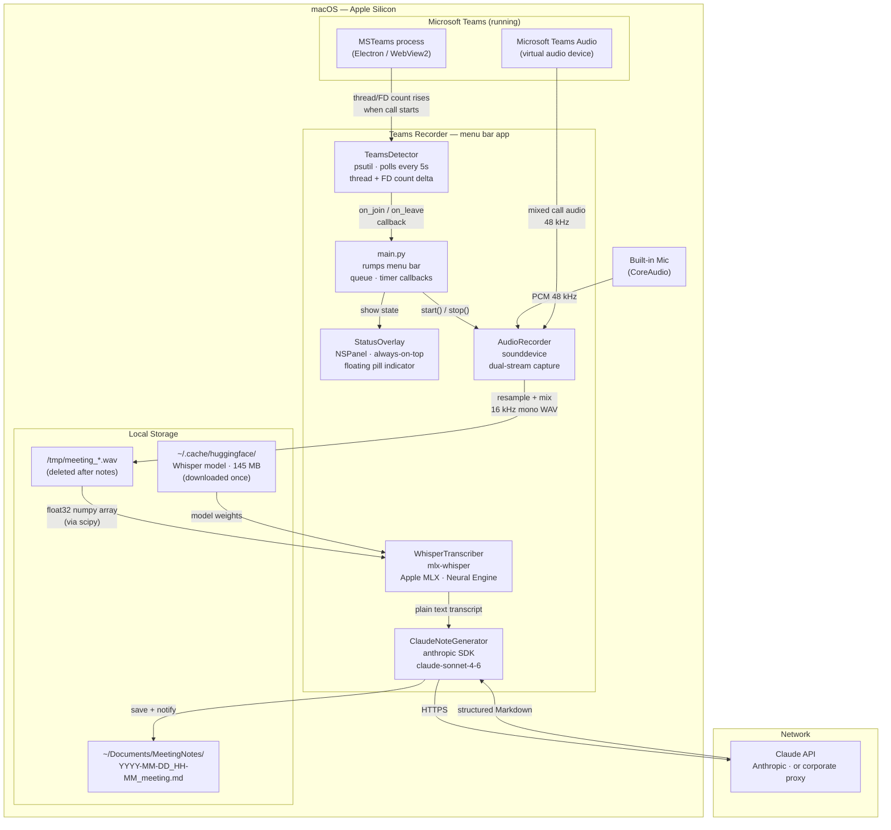
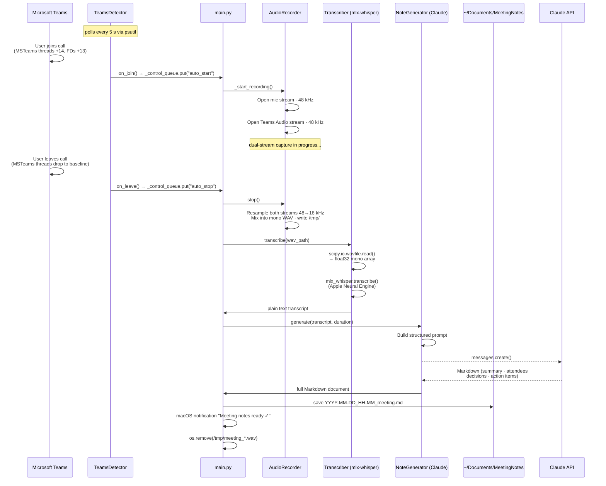
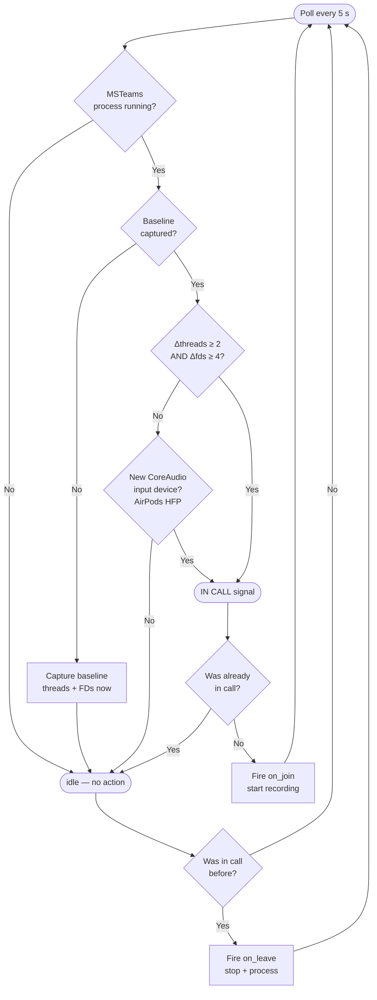

# Teams Meeting Recorder

A macOS menu bar app that **automatically records Microsoft Teams calls**, transcribes them locally on-device using Apple Silicon, and generates structured meeting notes via Claude AI — all without uploading audio to any third-party service.

---

## What It Does

1. **Detects** when a Teams call starts — automatically, by monitoring the MSTeams process
2. **Records** audio from both your microphone and the Microsoft Teams Audio virtual device (captures your voice + all participants)
3. **Transcribes** the recording locally using [mlx-whisper](https://github.com/ml-explore/mlx-examples) on Apple's MLX framework — no internet, no PyTorch, no ffmpeg
4. **Generates** structured meeting notes (summary, attendees, decisions, action items) via Claude API
5. **Saves** a Markdown file to `~/Documents/MeetingNotes/` and shows a macOS notification

---

## Architecture

### Component Overview



---

### Event Sequence: Automatic Recording Flow



---

### Call Detection Logic



---

## Prerequisites

### Hardware
- **Apple Silicon Mac** (M1, M2, M3 or later) — required for mlx-whisper (MLX framework only runs on Apple Silicon)

### Operating System
- **macOS 14 Sonoma or later** (tested on macOS 26.3 Tahoe / Apple M3)

> **macOS privacy note:** macOS 14+ blocks all CoreAudio-based mic-usage detection APIs (`kAudioDevicePropertyDeviceIsRunningSomewhere` returns error on macOS 26). This app works around this by monitoring the MSTeams process resource usage instead.

### Python
- **Python 3.11 or 3.12** (Python 3.13 not tested)
- Install via Homebrew: `brew install python@3.12`

### Microsoft Teams
- **Microsoft Teams v2** (the Electron/WebView2-based version available from the Microsoft website or Mac App Store)
- Teams must be running for auto-detection to work
- Teams creates a virtual audio device called **"Microsoft Teams Audio"** that exposes full call audio — this is how the recorder captures remote participants

### Anthropic API Key
- Required for meeting notes generation via Claude
- Standard key: get one at [console.anthropic.com](https://console.anthropic.com/)
- Corporate/proxy users: set `ANTHROPIC_BASE_URL` to your proxy endpoint (see `.env.example`)

### macOS Permissions Required (first run)
| Permission | Why | How granted |
|-----------|-----|------------|
| **Microphone** | Capture your voice during calls | macOS prompts automatically on first recording |

> **No Screen Recording permission needed.** The recorder reads from the Microsoft Teams Audio virtual device (a standard audio input device), not from screen capture. No ScreenCaptureKit, no special entitlements.

> **No Speech Recognition permission needed.** We use mlx-whisper locally via the MLX framework, which does not trigger macOS TCC speech recognition checks.

---

## Installation

### 1. Clone the repository

```bash
git clone https://github.com/Shaileshgnaik/teams-recorder.git
cd teams-recorder
```

### 2. Run the setup script

```bash
chmod +x setup.sh && ./setup.sh
```

This will:
- Create a Python virtual environment (`venv/`)
- Install all dependencies from `requirements.txt`
- Copy `.env.example` → `.env`
- Create `~/Documents/MeetingNotes/`

### 3. Configure your API key

Edit `.env`:

```bash
# Standard Anthropic key
ANTHROPIC_API_KEY=sk-ant-your-key-here

# Corporate proxy (optional — e.g. SAP AI Core or similar)
# ANTHROPIC_BASE_URL=http://localhost:6655/anthropic/
```

### 4. Run the app

```bash
source venv/bin/activate
python app/main.py
```

A white circle ⚪ appears in your macOS menu bar. The app is ready.

### 5. First transcription

On the first run, mlx-whisper downloads the Whisper model (~145 MB) from HuggingFace to `~/.cache/huggingface/`. Subsequent runs use the local cache — no internet needed for transcription.

---

## Usage

### Automatic mode (default)
- Join a Teams call → recording starts automatically within 5 seconds
- Leave the call → recording stops, transcription and notes are generated
- A macOS notification fires when notes are ready
- Notes are saved to `~/Documents/MeetingNotes/YYYY-MM-DD_HH-MM_meeting.md`

### Manual mode
Click the ⚪ menu bar icon → **▶ Start Recording** to record manually at any time.

### Menu options
| Item | Description |
|------|-------------|
| Status: Idle / Recording / ... | Current state (display only) |
| ▶ Start Recording | Begin recording manually |
| ■ Stop Recording | Stop and generate notes |
| 📁 Open Notes Folder | Open `~/Documents/MeetingNotes/` in Finder |
| Auto-detect Teams: ON ✓ | Toggle automatic call detection |
| Quit | Stop and exit |

### Status overlay
A small floating pill appears in the top-right corner of the screen during recording/processing. It stays visible even when Teams' orange microphone call widget covers the menu bar icon. You can drag it to reposition.

| Overlay | Meaning |
|---------|---------|
| 🔴 Recording... | Audio capture in progress |
| ⏳ Processing... | Transcribing + generating notes |
| ⚠️ Error message | Something went wrong |

---

## How It Works

### Call Detection (`teams_detector.py`)

**Problem:** macOS 14+ (Sonoma/Tahoe) intentionally blocks `kAudioDevicePropertyDeviceIsRunningSomewhere` — a CoreAudio property that used to indicate microphone usage. It now returns error code `-1` for all devices as a privacy protection. IOAudioEngine state queries are similarly blocked.

**Solution:** Monitor the `MSTeams` main process resource usage via `psutil`:
- At startup, capture baseline: MSTeams thread count and open file descriptor count
- Every 5 seconds, check current values
- If **both** thread delta ≥ 2 **and** FD delta ≥ 4 → call is active
- When threads drop back to baseline (even if FDs linger briefly) → call ended

Observed values on Apple M3 / macOS 26.3:
```
State       Threads    FDs
Idle        64-66      72-73
In-call     67-82      77-94
Post-call   64-66      73-79  ← FDs linger but threads drop → AND condition fails
```

Secondary signal: if new CoreAudio input devices appear (e.g. AirPods switching from A2DP to HFP mode when Teams activates them for a call), that also triggers detection.

### Audio Recording (`recorder.py`)

Opens two simultaneous audio streams via `sounddevice`:
1. **Default microphone** — captures your voice
2. **Microsoft Teams Audio** virtual device — captures the full call mix (all participants as processed by Teams)

Both streams are captured at each device's native sample rate (typically 48 kHz), then resampled to 16 kHz using `scipy.signal.resample_poly` and mixed into a single mono WAV file.

> **Why two streams?** The microphone alone misses remote participants. The Teams Audio virtual device alone can miss your local voice in some configurations. Mixed together, the transcript is complete.

### Transcription (`transcriber.py`)

Uses **mlx-whisper** — Whisper running on Apple's MLX framework:
- Loads the WAV with `scipy.io.wavfile.read()` — no ffmpeg dependency
- Converts to float32 mono at 16 kHz (Whisper's required format)
- Passes the numpy array directly to `mlx_whisper.transcribe()`
- Model: `mlx-community/whisper-base.en-mlx` (~145 MB, English only)
- Change model via `WHISPER_MODEL` env var (e.g. `mlx-community/whisper-small.en-mlx` for better accuracy)

> **Why not openai-whisper?** It requires PyTorch (~2 GB) and ffmpeg. mlx-whisper needs ~50 MB and uses Apple Silicon's Neural Engine.

### Note Generation (`note_generator.py`)

Sends the transcript to Claude (`claude-sonnet-4-6` by default) with a structured prompt that extracts:
- Meeting summary
- Attendees (inferred from names in transcript)
- Topics discussed
- Key decisions
- Action items with owners

The output is saved as a Markdown file with YAML frontmatter (compatible with Obsidian, Notion import, etc.).

### Status Overlay (`overlay.py`)

A borderless `NSPanel` (PyObjC AppKit) that floats above all windows, joins all Spaces, and remains visible in full-screen mode. This is necessary because Teams' orange microphone call widget physically replaces the app's menu bar icon during calls — without the overlay, there is no visible indicator that recording is active.

---

## File Structure

```
teams-recorder/
├── app/
│   ├── main.py              # Menu bar app entry point (rumps + AppKit)
│   ├── recorder.py          # Audio capture (sounddevice, dual-stream)
│   ├── transcriber.py       # Speech-to-text (mlx-whisper, Apple MLX)
│   ├── note_generator.py    # Meeting notes via Claude API (anthropic SDK)
│   ├── teams_detector.py    # Call detection (psutil process monitoring)
│   ├── overlay.py           # Floating status window (PyObjC NSPanel)
│   ├── utils.py             # Audio mixing, WAV I/O, Markdown saving
│   └── diagnose_call.py     # Debugging tool (run manually, see below)
├── requirements.txt         # Python dependencies
├── setup.sh                 # One-time setup script
├── .env.example             # Environment variable template
└── .env                     # Your local config (gitignored)
```

---

## Configuration

All configuration is via `.env` (loaded automatically at startup):

| Variable | Required | Default | Description |
|----------|----------|---------|-------------|
| `ANTHROPIC_API_KEY` | Yes | — | Anthropic API key |
| `ANTHROPIC_BASE_URL` | No | Anthropic default | Custom API endpoint (corporate proxy) |
| `ANTHROPIC_MODEL` | No | `claude-sonnet-4-6` | Claude model for notes generation |
| `WHISPER_MODEL` | No | `mlx-community/whisper-base.en-mlx` | mlx-whisper model (base = fast, small = more accurate) |

### Available Whisper models

| Model | Size | Speed (M3) | Accuracy |
|-------|------|-----------|----------|
| `mlx-community/whisper-base.en-mlx` | ~145 MB | ~1s / 40s audio | Good for clear speech |
| `mlx-community/whisper-small.en-mlx` | ~465 MB | ~3s / 40s audio | Better for accents/noise |
| `mlx-community/whisper-medium.en-mlx` | ~1.5 GB | ~8s / 40s audio | Best accuracy |

---

## Troubleshooting

### App doesn't detect call start
Run the diagnostic tool **during** a Teams call and compare with an idle run:
```bash
source venv/bin/activate
python app/diagnose_call.py
```
Look at the `MSTeams` thread and FD counts. If the delta during a call is consistently different from the thresholds in `teams_detector.py`, adjust `THREAD_DELTA_THRESHOLD` and `FD_DELTA_THRESHOLD` at the top of `app/teams_detector.py`.

### "Microsoft Teams Audio" device not found
Teams must be running for the virtual audio device to exist. If you start the app before Teams, the recorder falls back to microphone-only capture. Restart the app after Teams has fully loaded.

### Transcription is empty or very short
The recording may have captured only silence. This can happen if:
- Teams Audio device was not found (mic-only fallback, and the mic was muted)
- The call was very short (< 5 seconds before detection + recording started)
- PortAudio error opening the Teams Audio device at its native sample rate

Check the console for `[recorder]` lines to confirm which devices opened successfully.

### Claude API errors
- Check that `ANTHROPIC_API_KEY` is set correctly in `.env`
- If using a corporate proxy, verify `ANTHROPIC_BASE_URL` points to a live endpoint
- The `diagnose_call.py` script does not test the Claude API — test it separately with a quick `curl` to your endpoint

### macOS Microphone permission prompt never appears
On first launch, macOS should prompt for microphone access. If it doesn't:
1. Open **System Settings → Privacy & Security → Microphone**
2. Ensure Python (or your Python framework) is listed and enabled

---

## Development

### Running without the menu bar UI (for testing)

```python
# Quick pipeline test — no GUI needed
from app.recorder import AudioRecorder
from app.transcriber import WhisperTranscriber
from app.note_generator import ClaudeNoteGenerator

r = AudioRecorder()
r.start()
input("Press Enter to stop...")
wav = r.stop()

t = WhisperTranscriber()
transcript = t.transcribe(wav)
print(transcript)

n = ClaudeNoteGenerator()
notes = n.generate(transcript)
print(notes)
```

### Adjusting call detection thresholds

If `teams_detector.py` produces false positives or misses calls on your machine, run `diagnose_call.py` idle and in-call, compare the MSTeams thread/FD numbers, and update these two constants in `teams_detector.py`:

```python
THREAD_DELTA_THRESHOLD = 2   # minimum thread increase above baseline
FD_DELTA_THRESHOLD     = 4   # minimum FD increase above baseline
# Both must be exceeded simultaneously (AND logic) to declare "in call"
```

---

## Known Limitations

- **Apple Silicon only** — mlx-whisper requires the MLX framework which only runs on M-series chips
- **English transcription** — default model is English-only; switch to a multilingual model (e.g. `mlx-community/whisper-base-mlx`) for other languages
- **5-second detection latency** — the detector polls every 5 seconds; recording starts up to 5 seconds after the call begins
- **Teams must be running at app start** for baseline capture; if Teams restarts, the baseline may drift (restart the recorder app to re-baseline)
- **macOS 14+ only** — PyObjC AppKit APIs used for the overlay require macOS 14+
- **Single-user** — designed for personal use; no multi-user or shared-drive output support

---

## Glossary

### Audio & Hardware

| Term | Definition |
|------|-----------|
| **Apple Silicon** | Apple's own ARM-based chips (M1, M2, M3, M4). Required because the MLX framework — which runs the Whisper model — is built exclusively for Apple's hardware and Neural Engine. |
| **MLX Framework** | Apple's open-source machine learning framework optimised for Apple Silicon. Replaces PyTorch for on-device AI inference. Runs models on the CPU, GPU, or Neural Engine without needing CUDA or ROCm. |
| **Neural Engine** | A dedicated processor core inside Apple Silicon chips designed for fast, low-power matrix operations (used by AI/ML models). mlx-whisper uses it automatically when running inference. |
| **PCM (Pulse Code Modulation)** | The standard raw digital audio format. Audio is represented as a sequence of numeric samples — one sample per time step. Higher sample rate = more samples per second = better audio quality. |
| **Sample Rate / kHz** | How many audio samples are captured per second. 48 kHz = 48,000 samples/second (microphone native). Whisper requires 16 kHz, so we resample down with `scipy.signal.resample_poly`. |
| **Mono / Stereo** | Mono = one audio channel. Stereo = two channels (left + right). Whisper requires mono input, so stereo recordings are averaged into a single channel before transcription. |
| **WAV file** | A standard uncompressed audio file format. Stores raw PCM samples. Chosen here because `scipy.io.wavfile` can read/write it without any external tools like ffmpeg. |
| **Virtual Audio Device** | A software-only audio device that appears in macOS just like a real microphone or speaker. Microsoft Teams creates one called "Microsoft Teams Audio" that exposes the full call mix (all participants) as a capturable input stream. |
| **A2DP (Advanced Audio Distribution Profile)** | A Bluetooth profile used for high-quality stereo audio streaming — e.g., music from your Mac to AirPods. In A2DP mode, AirPods are output-only and have no microphone input streams. |
| **HFP (Hands-Free Profile)** | A Bluetooth profile used for phone/call audio. When Teams starts a call and activates AirPods as a microphone, they switch from A2DP → HFP mode, which adds input streams to the device. This switch is detectable via CoreAudio and is used as a secondary call-detection signal. |
| **PortAudio** | A cross-platform C library for audio I/O. `sounddevice` (Python) is a wrapper around it. Handles opening and managing audio streams to physical and virtual devices. |
| **Resampling** | Converting audio from one sample rate to another. This app captures at 48 kHz (device native) and resamples to 16 kHz for Whisper using `scipy.signal.resample_poly` — a high-quality polyphase filter. |
| **float32 / int16** | Audio data types. `float32` stores each sample as a 32-bit floating point number in the range [-1.0, 1.0] — easy for maths. `int16` stores it as a 16-bit integer in [-32768, 32767] — compact for WAV files. We record as float32, convert to int16 before saving. |

---

### macOS System

| Term | Definition |
|------|-----------|
| **CoreAudio** | Apple's low-level audio framework for macOS. Manages all audio hardware (physical and virtual devices), routing, permissions, and I/O. All audio on macOS ultimately goes through CoreAudio. |
| **CoreAudio HAL (Hardware Abstraction Layer)** | The layer of CoreAudio that talks to actual audio hardware. Exposes a unified API for querying device properties, opening audio streams, and monitoring device state regardless of the underlying hardware. |
| **`kAudioDevicePropertyDeviceIsRunningSomewhere`** | A CoreAudio property (constant `'hsrs'`) that was supposed to indicate whether any application is currently using an audio device. On macOS 14+ (Sonoma/Tahoe) it intentionally returns error `-1` for all devices as a privacy protection — preventing apps from spying on whether others are using the microphone. |
| **IOKit / IOAudioEngine** | Apple's kernel framework for interacting with hardware devices. `IOAudioEngine` is the kernel object representing an audio processing engine. In theory its `IOAudioEngineState` property reflects mic activity, but on macOS 26 (Tahoe) it returns no data — also privacy-protected. |
| **TCC (Transparency, Consent, and Control)** | macOS's privacy enforcement system. Controls which apps can access the microphone, camera, contacts, screen recording, etc. When an app first requests access, TCC shows a permission dialog and stores the result in a system database. `tccd` is the daemon that enforces TCC rules. |
| **AppKit** | Apple's macOS UI framework. Provides all native window, menu, button, and panel classes. This app uses it via PyObjC for the floating status overlay (`NSPanel`) and menu bar integration. |
| **PyObjC** | A Python bridge to Apple's Objective-C frameworks (AppKit, Foundation, CoreAudio, etc.). Lets Python code create native macOS UI elements and call system APIs directly. Required for `overlay.py`. |
| **NSPanel** | A special type of macOS window (`NSWindow` subclass) designed for utility panels. Unlike regular windows, NSPanels can float above all other windows and stay visible across all Spaces and in full-screen mode — which is why it's used for the recording status overlay. |
| **NSStatusBar / Menu Bar** | The macOS menu bar area at the top of the screen where app icons and system indicators live. `rumps` wraps `NSStatusBar` to create the ⚪ menu bar icon in Python. |
| **Spaces** | macOS virtual desktops. You can have multiple Spaces and switch between them. The `NSWindowCollectionBehaviorCanJoinAllSpaces` flag makes the overlay visible on all of them simultaneously. |
| **rumps** | "Ridiculously Uncomplicated macOS Python Statusbar apps" — a Python library that wraps `NSStatusBar` and `NSMenu` to make menu bar apps easy. Runs on the main thread; all UI updates must come through it. |

---

### AI & Machine Learning

| Term | Definition |
|------|-----------|
| **Whisper** | An open-source speech recognition model released by OpenAI in 2022. Trained on 680,000 hours of multilingual audio. Converts audio waveforms into text transcripts. Available in multiple sizes (base, small, medium, large) trading off speed vs. accuracy. |
| **mlx-whisper** | A port of the Whisper model to Apple's MLX framework. Runs natively on Apple Silicon without PyTorch or ffmpeg. ~50 MB install vs. ~2 GB for openai-whisper. Achieves ~1 second transcription time for 40 seconds of audio on M3. |
| **HuggingFace** | A platform hosting open-source AI models and datasets. mlx-whisper downloads model weights from `huggingface.co` on first use and caches them in `~/.cache/huggingface/`. No account required for public models. |
| **LLM (Large Language Model)** | A type of AI model trained on vast amounts of text, capable of understanding and generating human language. Claude (Anthropic) and GPT (OpenAI) are examples. This app uses Claude to turn a raw transcript into structured meeting notes. |
| **Claude API / Anthropic SDK** | Anthropic's API for accessing Claude models. The Python SDK (`anthropic` package) handles authentication, request formatting, and response parsing. Called via `client.messages.create()` with a prompt and model name. |
| **claude-sonnet-4-6** | The specific Claude model used for note generation. "Sonnet" is the mid-tier model — fast and capable, balancing cost and quality. The number refers to the model version/generation. |
| **Prompt / System Prompt** | The instructions sent to an LLM telling it what to do. This app's prompt instructs Claude to extract attendees, decisions, and action items from the transcript and format them in Markdown with specific section headings. |
| **Tokens / max_tokens** | LLMs process text as "tokens" (roughly ¾ of a word each). `max_tokens=2048` limits how long Claude's response can be — enough for detailed meeting notes without excessive API cost. |
| **Transcription** | Converting spoken audio into written text. Done locally by mlx-whisper. The resulting plain text is then passed to Claude for structured formatting. |
| **YAML Frontmatter** | Metadata block at the top of a Markdown file, delimited by `---`. Stores structured data (date, duration, tags) that Markdown viewers like Obsidian use for searching, filtering, and sorting notes. |

---

### Programming & Architecture

| Term | Definition |
|------|-----------|
| **psutil** | "Process and System Utilities" — a Python library for querying running processes, CPU usage, memory, file descriptors, and more. Used here to monitor the MSTeams process thread count and file descriptor count to detect call activity. |
| **File Descriptor (FD)** | A number the OS assigns to every open file, socket, or pipe a process has. When Teams starts a call, it opens new connections (sockets, audio streams) → its FD count increases. `psutil.Process.num_fds()` returns the current count. |
| **Thread** | A unit of execution within a process. More threads = more parallel work happening. Teams spawns extra threads when processing audio during a call. `psutil.Process.num_threads()` returns the current count. |
| **Baseline** | The normal idle measurement captured when the app starts (before any call). Used as a reference point — we compare current values against baseline to detect the increase caused by an active call. |
| **Delta (Δ)** | The difference between current value and baseline. `Δthreads = current_threads - baseline_threads`. If Δ exceeds a threshold, a call is considered active. |
| **AND Logic (vs OR)** | The call detection condition requires **both** Δthreads ≥ threshold **AND** Δfds ≥ threshold to be true simultaneously. Using OR caused false positives because FDs linger above threshold for several seconds after a call ends even after threads return to baseline. AND naturally clears when threads normalise. |
| **Thread Safety** | Ensuring that code running on multiple threads doesn't corrupt shared data. `rumps` (and AppKit) require all UI updates to happen on the main thread. Background threads post messages to `queue.Queue` objects; a `@rumps.timer` callback drains the queue on the main thread every 0.5 seconds. |
| **Callback** | A function passed to another function to be called later when an event occurs. `TeamsDetector.start(on_join, on_leave)` takes callbacks that fire when a call starts or ends. |
| **Polling** | Repeatedly checking a condition at a fixed interval (every 5 seconds here) rather than being notified instantly. Simpler than event-driven approaches but introduces up to 5 seconds of detection latency. |
| **Daemon Thread** | A background thread that is automatically killed when the main program exits. All background threads in this app (`TeamsDetector`, `Pipeline`) are daemon threads so quitting the menu bar app cleanly terminates them. |
| **Virtual Environment (venv)** | An isolated Python installation in the `venv/` folder. Keeps this project's dependencies separate from the system Python, avoiding version conflicts. Activated with `source venv/bin/activate`. |
| **Electron / WebView2** | Microsoft Teams v2 is built on Electron (a framework for building desktop apps using web technologies — HTML, CSS, JavaScript). It embeds a Chromium-based WebView2 for rendering. Teams' audio capture uses WebRTC inside this embedded browser engine. |
| **WebRTC** | "Web Real-Time Communication" — a browser standard for real-time audio/video calls. Teams uses it internally for call audio. WebRTC in Electron bypasses some traditional CoreAudio monitoring paths, which is partly why `DeviceIsRunningSomewhere` doesn't detect it. |
| **scipy.signal.resample_poly** | A high-quality audio resampling function using polyphase filtering. "Poly" = multiple phases, allowing exact rational ratio resampling (e.g., 48000 → 16000 Hz = exactly 1:3 ratio) with minimal distortion. |
| **Corporate Proxy / `ANTHROPIC_BASE_URL`** | Some organisations route all external API traffic through an internal proxy server (e.g., SAP AI Core). Setting `ANTHROPIC_BASE_URL` points the Anthropic SDK to that proxy instead of directly to `api.anthropic.com`. The SDK is otherwise identical. |
